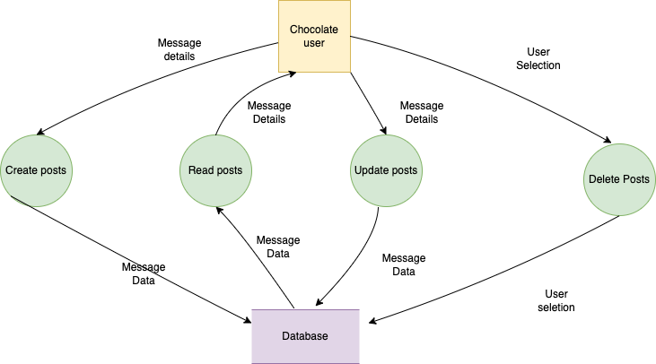
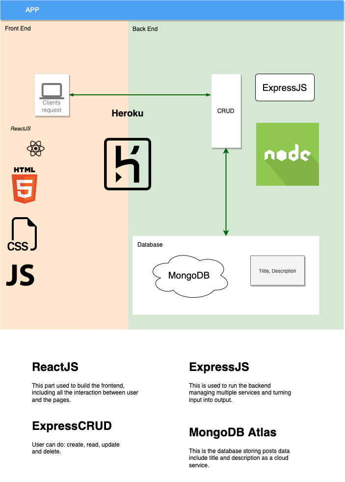
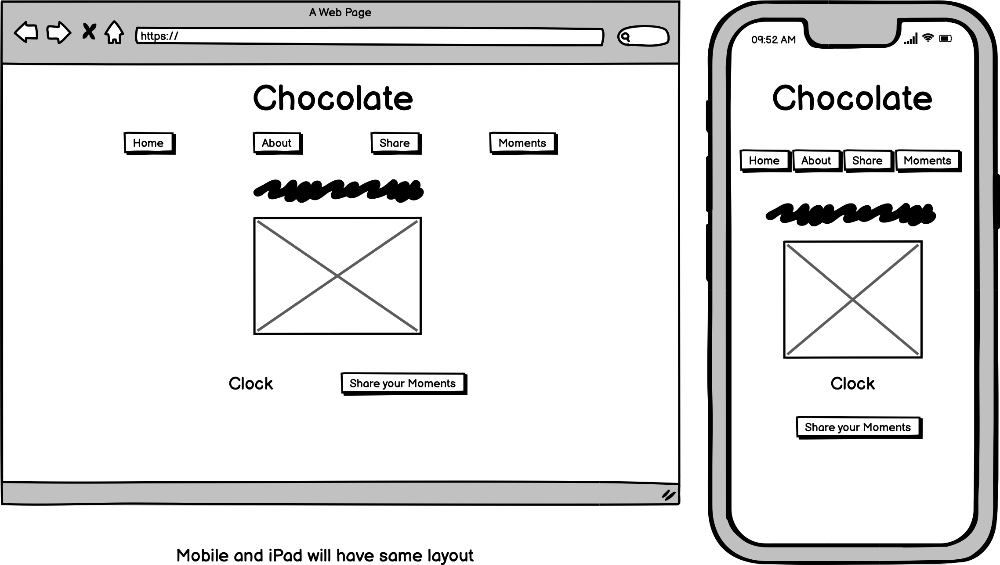
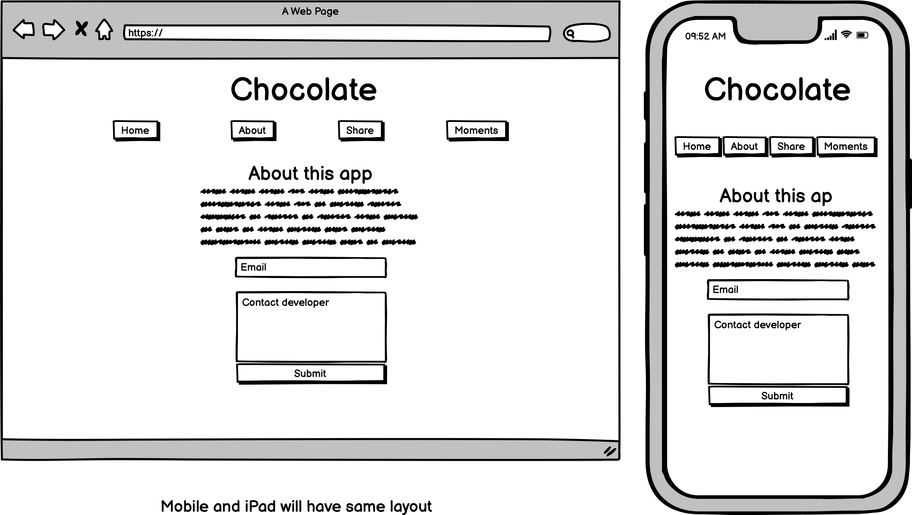
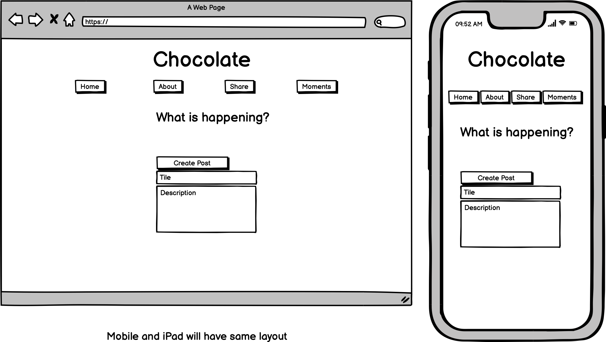
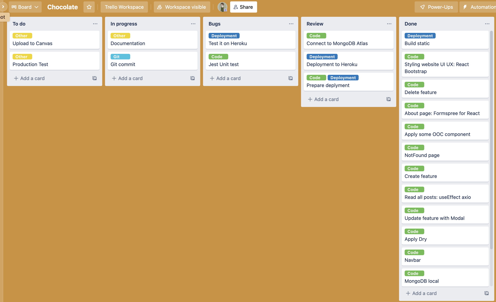

# **Chocolate**

## **Purpose**

"Life is like a box of chocolates, you never know what you're going to get."

The app is a platforms allow users to share information. Users will share moments on this app. 

## **Functionality / features**

*Chocolate* will provide funtionalities / features like:

- **Create a post**

- **Read all posts**

- **Update posts**

- **Delete posts**

- **Sending information to developer**

## **Target audience**

The target audiences of *Chocolate* would be:

- For group of friends who want to have their own place on the internet, and these people want to share informations.

## **Tech stack**

- JavaScript
- HTML/CSS
- ReactJS
- React Bootstrap
- Axios
- ExpressJS
- MongoDB
- Mongoose
- NodeJS
- Heroku
- Jest

### **Deployment**
- [Link to website](https://chocolatemoments.herokuapp.com)

### **Git**
- [Old repository for development](https://github.com/xinyirachel/chocolate-fullstack)
- [New repository for deployment](https://github.com/xinyirachel/chocolate-moments)

The old repository is the one I used when I develop the app, it has many branches and commits history. However, when I tried to deploy the app, the old repository caused error. So I create another repository and pushed the documents relate to the app to it. Later I find out the error is caused by the .git file in client folder.

## **Data Flow Diagram (DFD)**

## **Application Architecture Diagram (AAD)**

## **User Stories**

|User|Action|Reason|
|-|-|-|
|As a user|I want to share a post.|So that I could show my message to the public.|
|As a user|I want to edit a moment |So that I could correct any mistakes or add more information to it.|
|As a user|I want to read moments |So that I could know what is happening around other people.|
|As a user|I want to delete a moment |So that I remove what I don't want other to see.|
|As a user|I want to contact the developer.|So that I could ask questions.|

## **Wireframes**

## **Trello board**

## **Future Development**
In future. I plan to add autentication feature to the app.